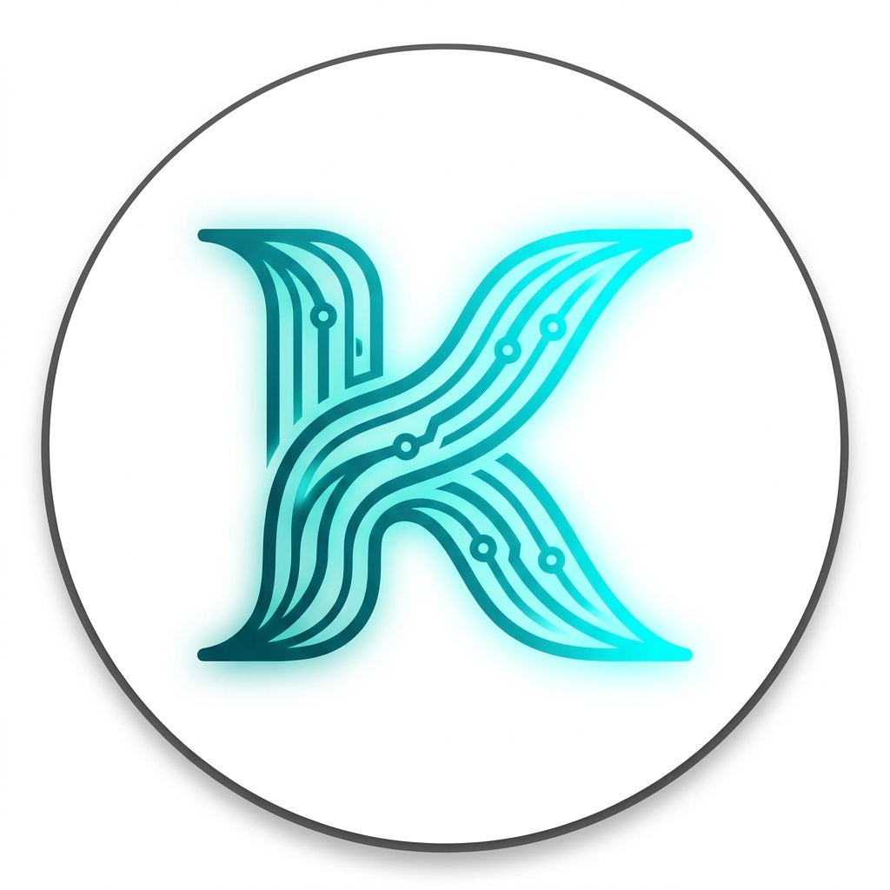
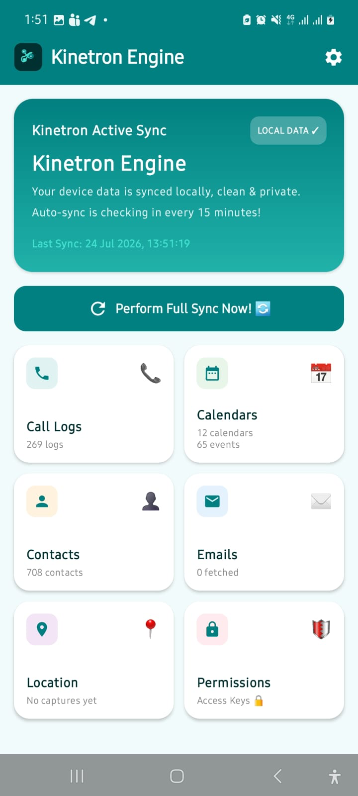
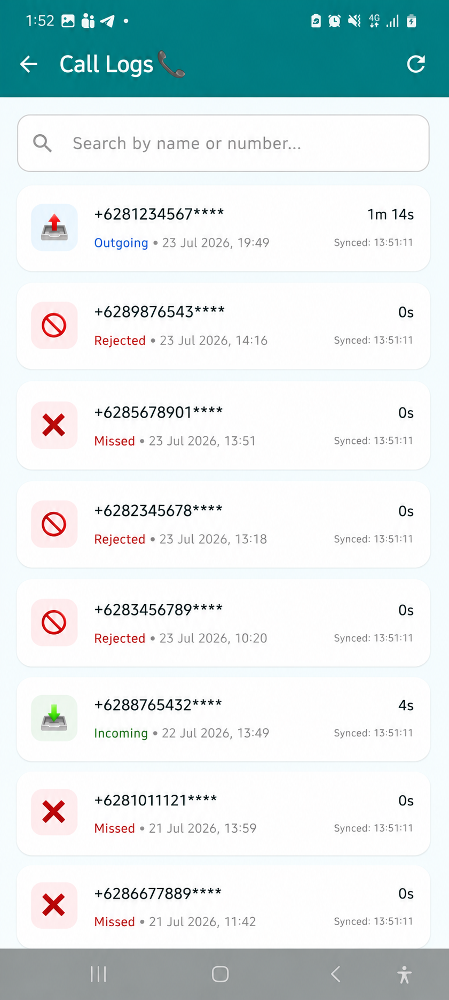
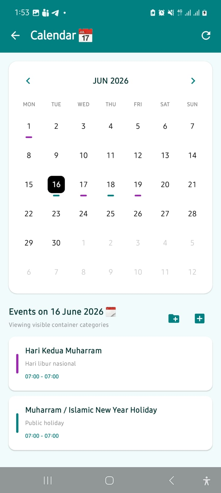
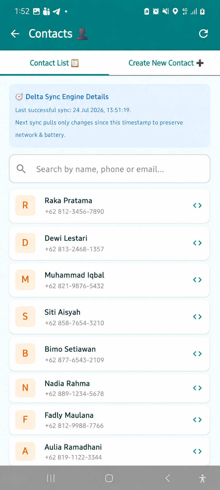
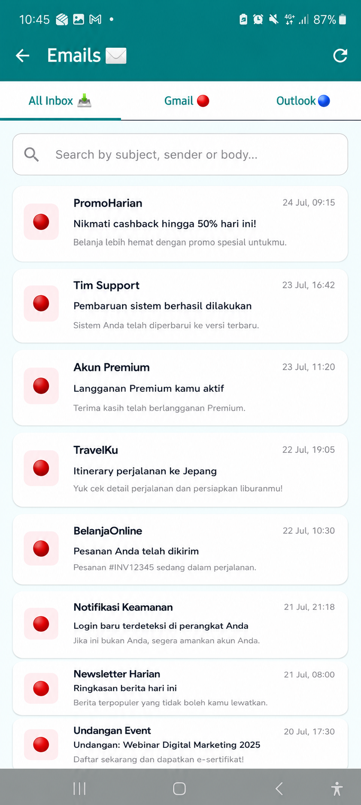
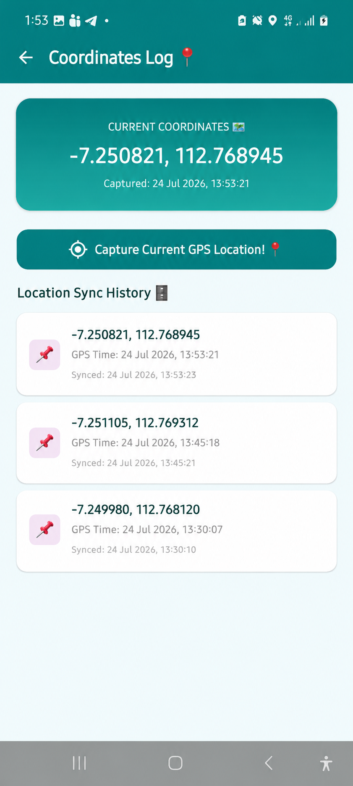
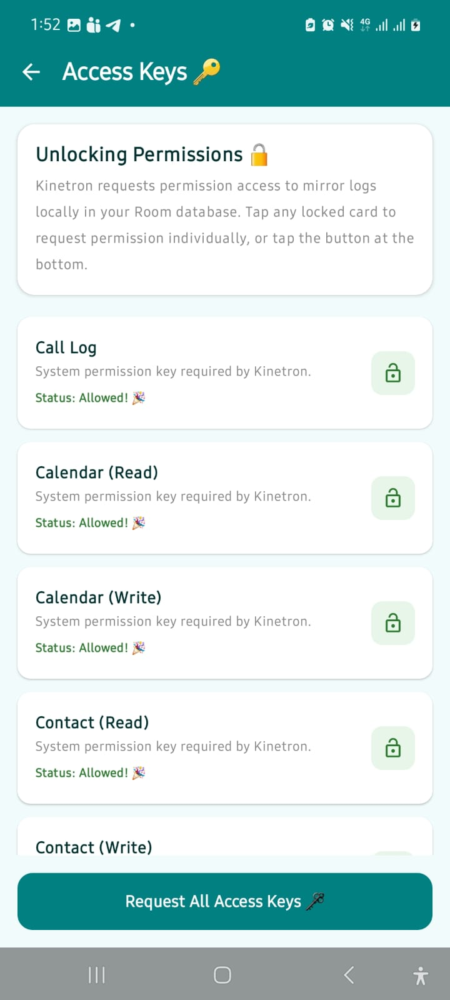
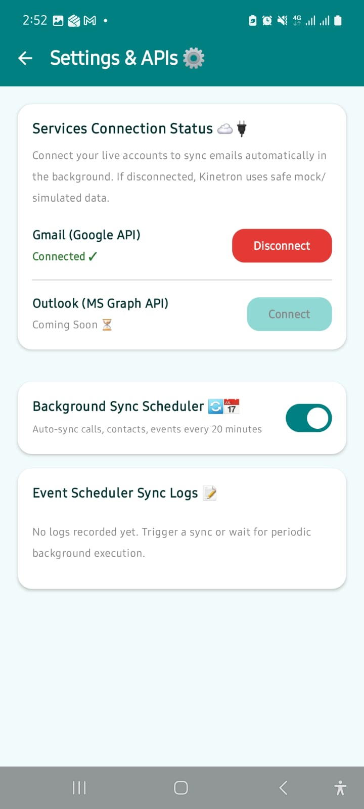

#  Kinetron Engine

[](https://developer.android.com/)
[](https://kotlinlang.org/)
[](https://developer.android.com/jetpack/compose)
[](https://opensource.org/licenses/MIT)

**Kinetron** is a premium, open-source Android synchronization client and dashboard engine. Designed with modern **Jetpack Compose** and **Atomic Design Principles**, Kinetron enables seamless local mirroring and organization of call logs, calendars, contacts, GPS coordinates, and Gmail threads into a unified, secure database.

## 📱 Application Screenshots

> 🛡️ *Note: Sensitive personal data in Call Log, Contact, and Location screens are represented with simulated dummy data.*

| Home | Call Logs | Calendar | Contacts |
| :---: | :---: | :---: | :---: |
|  |  |  |  |

| Gmail Sync | GPS Location | Permissions | Settings |
| :---: | :---: | :---: | :---: |
|  |  |  |  |

---

## 💡 The Problem & Business Solution

### ⚠️ The Problem
Integrating core Android system capabilities (such as call logs, system calendars, contacts databases, and GPS locations) with proprietary enterprise software (e.g., custom CRMs, logistics portals, centralized helpdesks) typically requires writing complex, custom integration layers. Developers often face challenges with background scheduling, battery optimization, local data caching, and unified OAuth email sync.

### ⚡ The Solution & Business Benefits
**Kinetron** bridges this gap by acting as a high-performance local integration hub, providing seamless background synchronization:

*   💼 **Sales & Custom CRM Integration**: Automatically capture and mirror call logs and contact details into local Room cache, which can be linked to customer relationship management tools for client communication analysis.
*   🚚 **Logistics & Fleet Tracking**: Seamlessly tracks background GPS locations and captures coordinate history to monitor fleet movements or verify driver dispatching.
*   🤝 **Centralized Helpdesk**: Consolidates Gmail and local mailboxes into a unified, secure database for client conversation auditing and analytics.
*   📅 **Unified Scheduling**: Integrates local calendar events directly with custom scheduling workflows, enabling seamless sync between Android device calendars and business systems.

### 🛡️ Privacy & Customer Consent Regulation
In compliance with strict privacy standards, Kinetron utilizes an interactive **Access Key Manager** (Permissions Screen). Users have full granular control to grant or revoke access keys explicitly, ensuring all background tracking and log caching align strictly with customer consent regulations.

---

## 🎨 Design Theme: Pebble Flow Network
Kinetron is themed around a professional, playful-yet-secure design language incorporating a curated teal/tosca color system with soft, modern indicator highlights.

---

## 🚀 Key Features

*   📞 **Call Log Mirroring**: Locally indexes call log details (incoming, outgoing, missed) with timestamp indicators.
*   📅 **Calendar & Event Manager**: Real-time month-view grid navigator with local event mapping and category containers.
*   👤 **Contact Explorer**: View contacts dynamically with built-in export representations for **vCard**, **JSON**, and **CSV**.
*   ✉️ **Gmail Sync Engine**: Integrates Google Sign-In SDK with server-auth-code exchange to pull, parse, and render rich HTML emails safely.
*   📍 **GPS Coordinate Logger**: Captures precise coordinates (latitude & longitude) using device location providers with sync audit trails.
*   ⏰ **Expedited WorkManager Scheduler**: Automated periodic sync triggers every 15 minutes, preserving battery and data usage.
*   🔑 **Access Key Manager**: Handles Android system permissions dynamically.

---

## 🛠️ Architecture & SOLID Design

The project is structured under **Clean Architecture** to separate concerns:
1.  **Data Layer**: Binds databases (Room Entity & DAOs) and remote APIs (Retrofit OAuth / Gmail services).
2.  **Domain Layer**: Clean interfaces and models for data mapping.
3.  **UI Component Layer (Atomic Design)**:
    *   **Atoms**: Standard base widgets (`KinetronButton`, `KinetronBadge`, `KinetronLoader`, `KinetronTextField`, `HtmlEmailViewer`).
    *   **Molecules**: Simple coupled blocks (`CallLogItemRow`, `ContactItemRow`, `EmailItemRow`, `LocationItemRow`, `PermissionItemRow`, `FeatureSyncHeader`).
    *   **Organisms**: Complex interface combinations (`CalendarCell`, `EmailDetailSheet`, `EventAddDialog`, `CalendarContainerDialog`).

---

## 📦 Tech Stack, APIs, & SDKs

*   **Jetpack Compose**: Modern declarative UI framework.
*   **Room Database**: Local SQL persistence layer.
*   **WorkManager**: Binds background task execution.
*   **Google Sign-In SDK**: OAuth server credential authentication.
*   **Gmail REST API**: Authenticated mail thread fetch.
*   **Android System ContentProviders**: System-level integration for call logs, calendar, and contacts.

---

## 🏁 Getting Started

### Prerequisites
*   Android Studio Ladybug (2024.2.1) or newer.
*   JDK 17.
*   Android SDK 34+.

### Step 1 — Clone the Repository

```bash
git clone https://github.com/abdulaziz733/Kinetron.git
cd kinetron
```

---

### Step 2 — Setup Google OAuth (Android Client)

Kinetron uses **Android-only OAuth** via Google Sign-In SDK. Token refresh is handled automatically by Google Play Services — **no credentials need to be stored in the project**.

#### 2a. Create a Google Cloud Project
1. Go to [console.cloud.google.com](https://console.cloud.google.com/).
2. Create a new project (e.g., `Kinetron`).
3. Navigate to **APIs & Services → Library** and enable:
   - `Gmail API`
4. Navigate to **APIs & Services → OAuth Consent Screen**:
   - Select **External** user type.
   - Fill in the App Name, Email, and Developer contact.
   - Add scope: `https://www.googleapis.com/auth/gmail.readonly`
   - Add your Gmail address as a **Test User**.

#### 2b. Get Your Debug SHA-1 Fingerprint
Run the following in the project root:

```bash
./gradlew signingReport
```

Look for the `:app` variant under **debug** and copy the **SHA1** value.

#### 2c. Create an Android OAuth Client ID
In **APIs & Services → Credentials → Create Credentials → OAuth Client ID**:

- **Type**: Android
  - Package name: `com.abdulaziz733.kinetron`
  - SHA-1 fingerprint: paste the value from Step 2b
- Click **Create**

> ✅ No Client ID or secret needs to be added to the project. Google Play Services identifies the app automatically using the package name and SHA-1 signature.

---

### Step 3 — Build & Run

```bash
./gradlew assembleDebug
```

Or simply open the project in **Android Studio** and press ▶ Run.

> **No `secrets.properties` or credential files needed.** The project is ready to build out of the box.


---


## 🤝 Contributing

Contributions are welcome! 🎉

If you'd like to contribute, please follow these steps:

1. Fork this repository
2. Create a new branch (`feature/your-feature-name`)
3. Commit your changes
4. Push to your branch
5. Open a Pull Request

Please make sure your code is clean, well-documented, and tested.

Feel free to open issues for bugs, suggestions, or discussions.

---

## 📝 License
This project is licensed under the MIT License.

